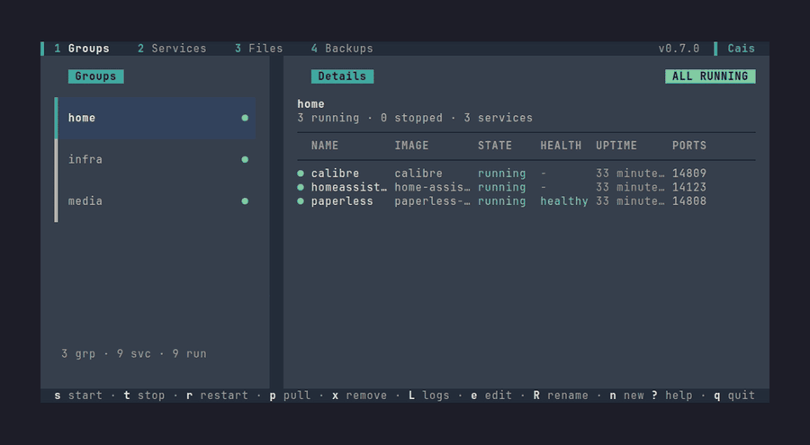
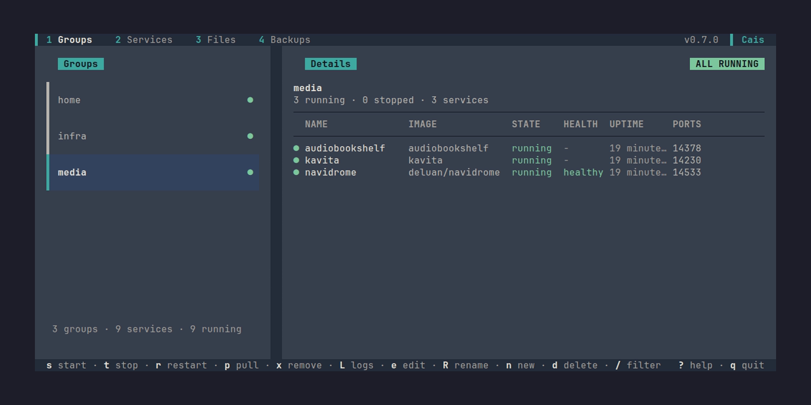
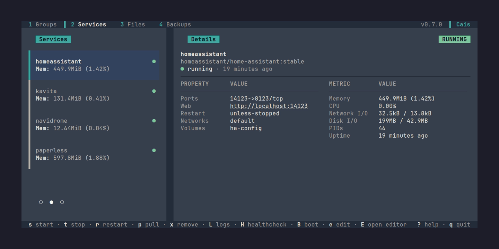
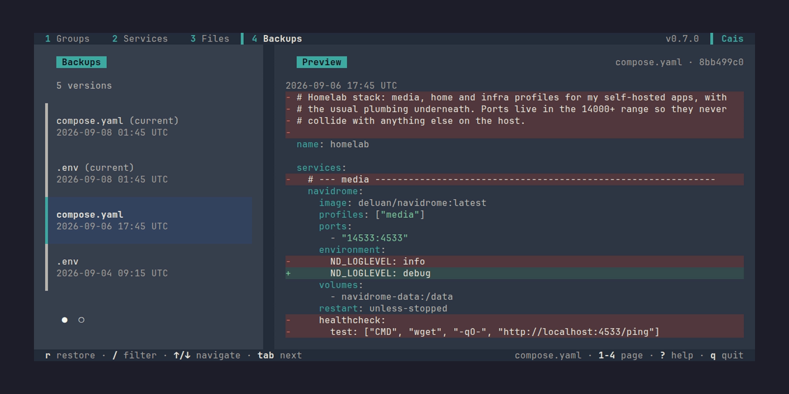
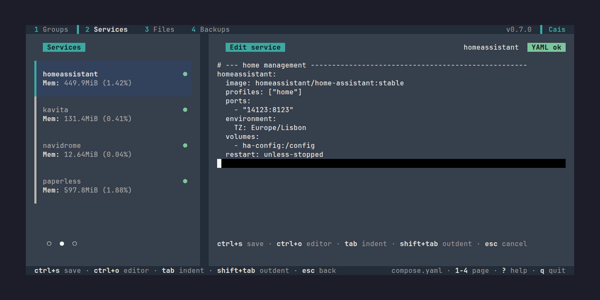
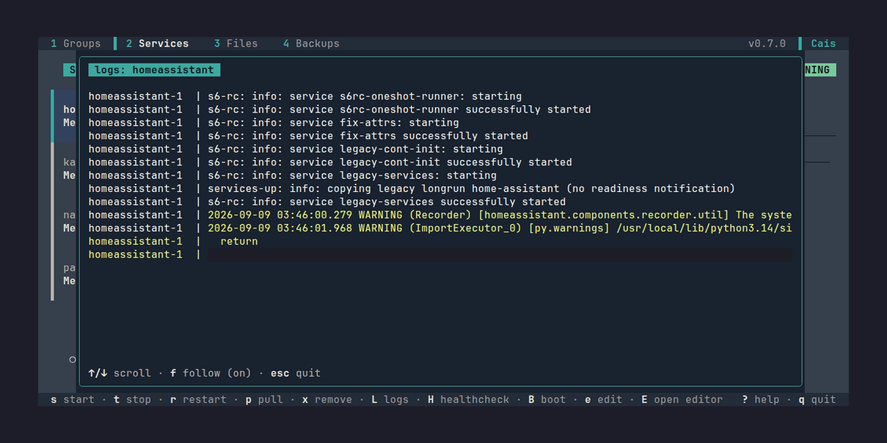
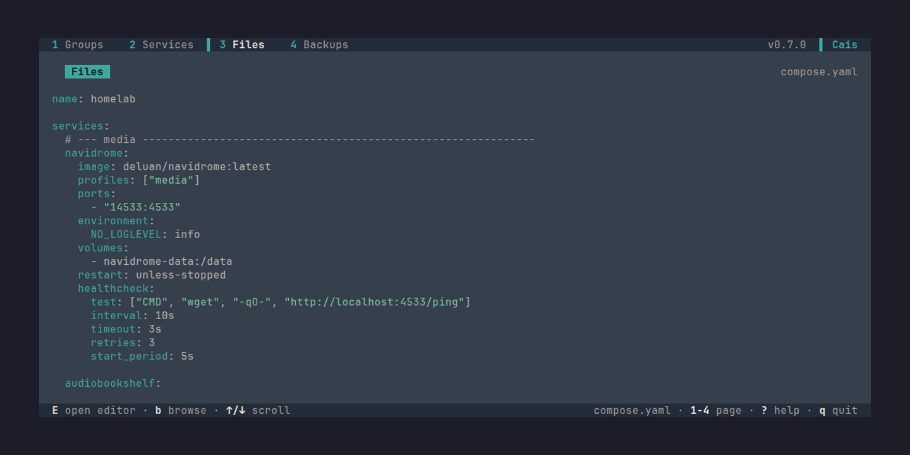
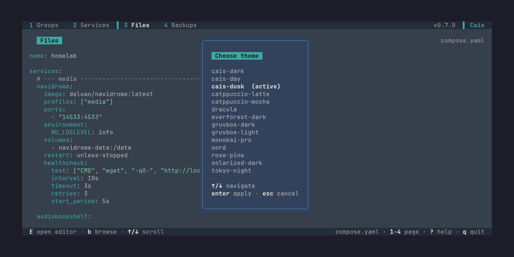

# Cais

**Run your self-hosted stack from the terminal, without leaving your compose file behind.**

[](https://github.com/filipemolina/cais/actions/workflows/ci.yml)


## Demo



Cais is a keyboard-driven terminal UI for a self-hosted stack running on
Docker Compose. It reads your `compose.yml` and groups services the way you think about
them. Nothing extra to host and nothing listening on a port.

Your compose file stays the source of truth. Every change Cais makes is
written back into that file, comments and key order intact, so `docker compose`
on the command line and Cais never disagree about what your stack is.

## What it does

**Writes that cannot destroy your stack.** Every change Cais makes reaches
your compose or `.env` file through a single atomic write path. The existing
file is snapshotted into `.cais/backups/` before it is replaced, so a bad edit
is always reversible, and the replacement is a single rename that lands in full
or not at all. No half-written file, no lost original if the disk fills or the
process is killed mid-write. The `.env` beside your compose file is backed up
alongside it, and a `.cais/.gitignore` keeps the store out of `git status`.

**Groups, not a flat list of containers.** A group is a Compose `profiles:`
tag. Start all services in a group with one key, tail all their logs with another,
and see at a glance which are running, which are healthy, and on what ports.



**Everything you need to check your services.** Ports, restart policy,
networks, volumes, `depends_on`, healthcheck, image reference and resource
limits, beside live memory, CPU, network and disk I/O for the running container.



**A working link to the thing you just started.** The config details view shows
a link to the live service. Ctrl-click it, or copy it with `y`.
The app never opens a browser itself.

**A healthcheck in one keypress.** `h` on a selected service opens a picker of
templates: Postgres, MariaDB, Redis and nginx, each using a probe tool that
ships in the image it targets, plus a generic HTTP fallback. Enter writes a
validated `healthcheck:` block straight into the compose file.

**New services without leaving the terminal.** `n` on the Services page asks
for a name and an image reference, then writes a minimal `image:` fragment
straight into the compose file and opens the inline editor on it. Ports,
volumes and everything else get added in the same YAML you would have
hand-written, with live validation the whole way.

**The `.env` beside your compose file opens with one key.** `v` opens it as a
modal that holds the variable table, a key editor, and the raw file editor, all
in one surface. Variables are masked by default: `space` reveals the selected
value, `c` copies it, and add/edit/delete go through small modals with a confirm
on delete. `o` opens the whole file in an inline editor. Writes are
line-preserving, so comments and the variables you did not touch survive.

**Your backups are browsable and restorable.** Every compose and `.env` write is
snapshotted into `.cais/backups/` before it lands, so a bad edit is always
reversible. Tab `4` (Backups) lists every stored copy of the compose file and the
`.env`, newest first, with a live preview beside the list, and `enter` (or `r`)
restores the chosen copy over the live file. The current file is snapshotted
first, so a restore is itself undoable, and a restore that brings back the `.env`
also brings back its secrets, which the confirm makes clear.



**Edit the compose file in place, as YAML.** `e` opens the service's own
fragment in an inline editor: real YAML, not a form, so every Compose field is
reachable. It validates as you type, auto-indents on Enter, indents with
`tab`/`shift+tab`, and refuses to write a fragment that would not parse as
Compose.



**Logs without leaving.** `l` streams `docker compose logs -f` for a service or
a whole group in an overlay, with follow mode and scrollback.



<details>
<summary>More features</summary>

**The compose file itself,** syntax-highlighted and scrollable. `E` opens it in
your `$EDITOR`; `b` browses the other compose files in the same directory and
switches which one the app is driving.



**Three themes,** previewed live as you move the cursor: cais-dusk
(the default), cais-dark and cais-day. `Enter` applies and persists your
choice; `Esc` restores the one you started with. Plus Catppuccin Mocha,
Catppuccin Latte, Gruvbox Dark, Gruvbox Light, Tokyo Night, Nord, Dracula,
Solarized Dark, Everforest Dark, Rosé Pine and Monokai Pro for a total of
fourteen.



</details>

Also: create, rename, and delete groups; change which services belong to them;
confirm-guarded removes; an `ungrouped` row derived from the services carrying no
`profiles:` key, so a compose file with no profiles at all still has something to
select and act on (read-only — `A` adopts it for real); a status re-poll every
five seconds so panels reflect changes made outside the app; and a `?` overlay
listing every key, scrollable and `/`-filterable, with the ones that do nothing
on the current screen dimmed.

## Install

```bash
go install github.com/filipemolina/cais@latest
```

Or build from source:

```bash
git clone https://github.com/filipemolina/cais.git
cd cais
make build     # installs to $(go env GOPATH)/bin, usually ~/go/bin
```

Or grab a pre-built binary from the
[latest release](https://github.com/filipemolina/cais/releases/latest) —
Linux and macOS, amd64 and arm64, with `checksums.txt` beside them.

**Requirements:** Docker with the Compose plugin on your `PATH`, a terminal, and
Go 1.26+ to build. If something is missing or the daemon is not running, the
app says which one failed (missing Docker, missing Compose plugin, unreachable
daemon, or permissions) and gives you the exact command to fix it.

## Use

```bash
cais                                    # the compose file in this directory
cais --dir ~/homelab/media              # resolve one in that directory
cais --file ~/homelab/compose.prod.yml  # open exactly this file
```

With no flags it auto-detects `compose.yaml`, `compose.yml`,
`docker-compose.yaml`, `docker-compose.yml`, the same order Docker uses. The
file that wins is named in the footer, and it is passed as `--file` to every
`docker compose` call, so the commands always act on the file the panels
describe. In a directory with no compose file at all, the app offers to write
one.

### Keys

`?` lists every key in context. The ones worth knowing:

| Key | Action |
| --- | --- |
| `1` `2` `3` `4` | Groups / Services / Files / Backups (`[` and `]` step through them) |
| `↑` `↓` `k` `j` | Move the cursor; the details panel follows it |
| `Tab` | Move focus between the list and the details panel |
| `s` `t` `r` `p` `x` | Start · Stop · Restart · Pull · Remove (`x` confirms first) |
| `l` | Stream logs for the service, or for every service in the group |
| `y` | Copy a service's URL (when it publishes one) |
| `h` | Add a healthcheck from the template picker |
| `e` | Edit: a service's YAML inline, or a group's membership |
| `E` | Open the whole compose file in `$EDITOR` (the `.env` file, from the env modal opened with `v`) |
| `v` | Open the `.env` editor: the variable table, a key editor, and a raw file editor, in one modal |
| `n` | New: a group on the Groups page, a service on the Services page (name and image, then the inline editor opens on it), a variable from the env modal opened with `v` |
| `R` `d` | Rename group · Delete: the group on the Groups page, or the service's whole entry in the compose file on the Services page (both confirm first) |
| `B` | Cycle the service's restart policy: none → `on-failure` → `unless-stopped` → `always`, written straight into the compose file |
| `A` | Adopt or release the `ungrouped` row: writes (or removes) `profiles: [ungrouped]` on every untagged service, confirm-guarded |
| `/` | Filter the list by name |
| `u` | Docker disk and memory usage overlay |
| `T` `?` `a` `q` | Themes · Help · About · Quit |

Start/Stop/Restart/Pull/Remove run `docker compose` underneath, scoped to every
service in the group on the Groups page, to one service on the Services page.

## Status

Early, and honest about it. Everything shown above works today; what follows is
what does not, in the order it is being closed. The sequence and the reasoning
live in [docs/ROADMAP.md](docs/ROADMAP.md):

- **Blank lines between services are not preserved** across a write. Comments,
  quoting and key order are. This is accepted rather than fixed: a blank line
  inside a block scalar (`command: |`) is part of the string, and silently
  rewriting your data is a worse failure than losing your spacing.
- **A narrow terminal shows less, not worse.** Under roughly 130 columns the
  keybinding bar starts dropping hints, and a narrow details panel drops
  columns from the member table, widest and least important first, and never
  `q quit`, `? help` or the service's own name.

Issues and ideas are welcome, and at this stage they still change the
direction.

## Troubleshooting

Two SSH-specific gotchas worth knowing about, since they'll happen with any
terminal app, not just cais:

- **`cais: command not found`.** `~/go/bin` (where `go install` puts the
  binary) only lands on `PATH` via your shell's startup files, and which of
  those run depends on how the SSH session was opened — an inline command
  (`ssh host cais`) skips them entirely. If your `PATH` setup shells out to
  `go env GOPATH` to find that directory, make sure it runs *after* `go`
  itself is already on `PATH`, or just hardcode `$HOME/go/bin` instead.
- **Colors look wrong.** `TERM` survives SSH, but `COLORTERM` usually
  doesn't (most `sshd` configs don't forward it), so true-color rendering
  silently degrades to 256-color. If both ends support true color, force it
  for SSH sessions: `[ -n "$SSH_TTY" ] && export COLORTERM=truecolor` in the
  shell rc on the machine you're connecting *to*.

Full walkthrough, including why, in [the troubleshooting
guide](website/src/content/docs/users/troubleshooting.md).

## Built with

Go, [Bubble Tea](https://github.com/charmbracelet/bubbletea) /
[Lip Gloss](https://github.com/charmbracelet/lipgloss) for the UI, and
[compose-go](https://github.com/compose-spec/compose-go), the same parser
Docker itself uses, for the file. Docker actions shell out to the
`docker compose` CLI rather than binding the SDK, so what the app does is what
you would have typed.

## License

[MIT](LICENSE). © 2026 Filipe Molina.
