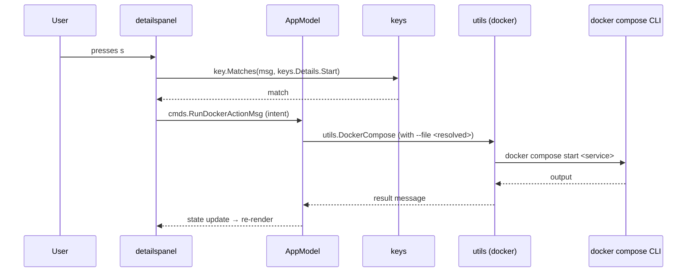

# Architecture

cais is a Bubble Tea application: a single top-level model (`AppModel`) receives every message, updates state, and renders a view. Everything else hangs off that loop.

## The seven layers

### 1. TUI Engine — Bubble Tea + Lip Gloss

The foundation. Bubble Tea provides the Elm-style message loop (`Init`/`Update`/`View`); Lip Gloss provides styling. `main.go` parses flags, loads config, resolves the compose file, and starts the `tea.Program`.

### 2. UI Components — `src/components`

One nested model per panel, list, modal, and overlay — 30+ files. Each component is a leaf model with its own `Model.go`, `Update.go`, and `View.go` (split out once the model earns it, roughly 150 lines). The constructor is always `New`; the exported type is always `Model`, so callers read as `serviceslist.New(...)`.

`src/components/chrome` is the one shared package: rendering and layout that more than one model needs (`PanelFrame`, panel body layout, key-hint rendering, the spinner, `HealthColor`/`Truncate`). A helper earns its way into `chrome` by having a second caller, not by convenience — a helper used by exactly one model stays unexported inside that model's package. This is enforced by the compiler, not by convention.

### 3. Data Types — `src/apptypes`

Shared data types: list items (`ServiceListItem`, `GroupListItem`), `DockerContainer`, `ThemeItem`, and the page definitions (`PageTitles`, `PageLabels`, `PageShortcut`).

### 4. App State — `src/model`

`AppModel` is the app: its `Init`/`Update`/`View`, and the message-routing that owns every screen. It holds navigation, config, selection, the pages map, modals, and pending actions. It is the only place that reads the terminal dimensions — components size themselves from a broadcast box and never derive width or height from `WindowSizeMsg`.

### 5. Configuration — `src/config`

Persisted preferences (`~/.config/cais/config.yaml`). One field today (`theme`), designed to absorb more without changing existing callers: add a field, tag it, and `LoadConfig`/`SaveConfig` round-trip it automatically.

### 6. Keybindings — `src/keys`

The single source of truth for every keybinding. A key is declared here exactly once; components match against these bindings, and the footer and help overlay render from them. See [Keybinding system](/contributors/keybinding-system/).

### 7. Utilities — `src/utils`

The non-Bubble Tea half: compose loading, YAML writing, docker exec, atomic writes, the backup store, service URL resolution, healthcheck templates, and the Docker preflight classifier.

## How the layers communicate

Everything flows through Tea message passing. A typical action — pressing `s` to start a service:

Two patterns are worth knowing:

- **The request/response split.** A component never learns which file is loaded. Panels emit an *intent* — `cmds.RunDockerActionMsg`, `cmds.CreateGroupRequestMsg`, `cmds.OpenEditorMsg` — and `AppModel` supplies the resolved file and runs the command. A success message drives a reload.
- **The broadcast pattern.** `AppModel` broadcasts layout (`cmds.SetBodyLayoutMsg`), stats, and the resolved compose file name (`cmds.SetComposeFileMsg`). A broadcast reaches only the active page's components — which is why the Files page re-reads its contents on activation rather than relying on a broadcast it may have missed.

## The one-resolution rule

The app resolves the compose file **once** and tells docker which one it picked. Every invocation starts from `utils.ComposeFileArgs`, which opens the argument list with `compose --file <path>`, so `utils.DockerCompose`, `utils.DockerComposePs`, and `utils.DockerLogs` act on exactly the file the panels are describing. A second resolution anywhere is the bug coming back — which is why write commands take the file name as an argument instead of resolving it again.

## Deliberate constraints

- **No Docker SDK.** Every docker call is `exec.Command("docker", …)` followed by `CombinedOutput()`. What the app does is what you would have typed.
- **No prefix key.** There is no guest program to address, so a prefix would add a mode to teach, render, and exit, and resolve no conflict.
- **The compose file is the source of truth.** No sidecar state, no separate groups file. Groups are derived from `profiles:` tags.
- **Minimal dependencies.** The YAML highlighter is hand-rolled rather than a lexer library: the app has one file to color, and Chroma is a heavy dependency against the minimal-deps stance.