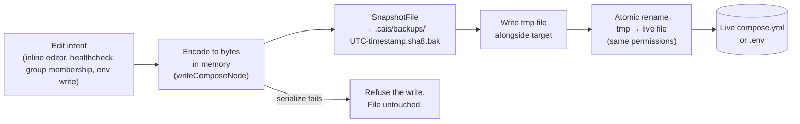

# Backup System

The compose file is the user's own, and it is the one piece of state the app cannot recreate. Every write to it goes through a single safety path, and the design exists because the alternative was tried first.

## The atomic write path

`utils.ReplaceFileAtomically` writes a temporary file alongside the target and renames it into place, carrying the original's permissions across. The replacement lands in full or not at all — no half-written file, no lost original if the disk fills or the process is killed mid-write.

**Nothing may write to a compose file with `os.WriteFile` or an `os.Create` truncation**: those destroy the original before the new contents are safely on disk, so a failure mid-write leaves the user with nothing. Encode into memory first, as `writeComposeNode` does, so that a serialisation error never reaches the file at all.

The rule the diagram encodes: **serialise, snapshot, tmp, rename — in that order, always.** A failure at any earlier step leaves the live file untouched, and by the time the rename runs the previous contents are already in `.cais/backups/`.

## The snapshot store

Before a file is replaced, `SnapshotFile` copies it into `.cais/backups/` beside the compose file. Each backup is named `UTC-timestamp.sha8-of-content.bak`:

- The **timestamp** sorts the store, newest first.
- The **SHA-8 content hash** deduplicates identical copies — writing the same content twice does not grow the store.
- The store is **pruned to 500 backups per source**.

A `.cais/.gitignore` keeps the store out of `git status`.

## The Backups page

`ListBackups` reads both source slugs (the compose file and the `.env`, when one sits next to it) and merges them into one list sorted by the embedded timestamp, descending. A source that has never been written returns an empty list, not an error, so a file with no history yet just shows the empty state.

The preview reads the chosen `.bak` from disk on selection; compose copies are shown syntax-highlighted through the same `src/highlight` layer the Files page uses, and `.env` copies are shown raw — the preview is the exact bytes a restore would put back.

## Restore is itself undoable

Restore goes through a confirm modal. `enter` or `r` on a row emits `RequestRestoreBackupMsg`; `AppModel` opens a `ConfirmModal` whose follow-up is `RestoreBackup`, which writes the chosen `.bak` back over the live file through `utils.ReplaceFileAtomically`.

Because the write is atomic, the live file is snapshotted into the store before it is replaced — so a restore is itself undoable: the copy you restored from still sits in the store, and a later restore of the post-restore snapshot brings the file you had back. A `.env` restore makes this explicit in the confirm text, because it brings the secrets back too.

A successful restore reloads the config (so the page and any `.env`-derived interpolation reflect the restored file) and re-lists the backups so the new post-restore snapshot appears; a failed one reports a foreground error.

## The request/response split

The page reuses the same split every other surface uses: the panel emits an intent (`cmds.GetBackups`, `RequestRestoreBackupMsg`), `AppModel` supplies the resolved paths and runs the command, and a success message drives a reload. The panel never learns which file is loaded, for the same reason the editor handoff does not — see *One resolution, passed down* in the architecture.

## Why this design

The compose file is the user's own, and it is the one piece of state the app cannot recreate. Every write to it goes through `utils.ReplaceFileAtomically`; the snapshot-before-replace rule is what makes a bad edit — a bad inline edit, a bad `$EDITOR` save, a bad healthcheck insertion — always reversible. The `.env` is backed up alongside it because a compose file without its secrets is not a working stack.