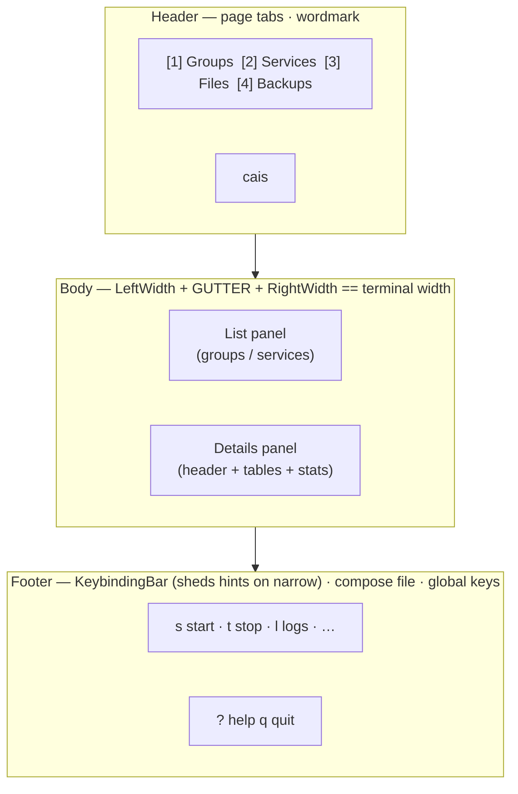

# Core Concepts

## The Tea loop

cais is a Bubble Tea application. Everything is a message: a keypress, a timer tick, a command result. `AppModel.Update` receives every message, updates state, and returns a view. Components are nested models — they receive the messages that concern them and hand back an updated model.

The two patterns that structure the flow:

- **The request/response split.** A component never learns which file is loaded. Panels emit an *intent* — `cmds.RunDockerActionMsg`, `cmds.CreateGroupRequestMsg`, `cmds.OpenEditorMsg` — and `AppModel` supplies the resolved file and runs the command. A success message drives a reload. This is why a component cannot supply the path: it does not know it and should not.
- **The broadcast pattern.** `AppModel` broadcasts layout (`cmds.SetBodyLayoutMsg`), stats, and the resolved compose file name (`cmds.SetComposeFileMsg`). A broadcast reaches only the active page's components — which is why the Files page re-reads its contents on activation rather than relying on a broadcast it may have missed.

## The AppModel

`AppModel` is the app: navigation, config, selection, the pages map, focus, modals, and pending actions. Two things it owns exclusively:

- **The terminal dimensions.** `AppModel` is the only place that reads `WindowSizeMsg`. Components size themselves from the broadcast box (`calculateBodyLayout` → `cmds.SetBodyLayoutMsg`) and never derive width or height from `WindowSizeMsg` — that message only reaches the components of the page that is active when it arrives, so a page that was not active during a resize would render at width 0.
- **Container-status refreshes.** A successful config load queues a foreground refresh; `cmds.RefreshContainersTick` re-schedules a five-second poll for the life of the app. Background results update status without clearing an unrelated error.

## Focus

`constants.FocusableComponents` holds only the two body panels; `Tab`/`Shift+Tab` alternate between them. The nav is id 0 but is **not** focusable — pages are switched with digits, and the nav never takes focus.

Component ids are part of the focus protocol (a component compares its id against `cmds.SetFocusMsg`), so they are *not* positions in the focus cycle. `ChangeFocus` derives the cycle position from the currently focused id so the two cannot disagree.

## The esc ladder

`esc` is "back", as a ladder of claims. Strongest first:

1. A modal closes itself.
2. A filter being typed owns the keyboard — esc abandons it.
3. A focused list holding an applied filter keeps esc, because esc is the only way back to the full rows.
4. What remains is the details panel, where esc returns focus to the list.

When a filter stands on an *unfocused* list, esc moves focus to the list first and clears the filter on the next press — the user is never stranded in a filtered list with no advertised way out. The footer offers `esc back` in the details contexts only.

The ladder is implemented as an interface (`OwnsKeyboard()`, `KeepsEsc()`), not a broadcast, because the answer has to be right on the very keystroke that changes it.

## Keyboard ownership

While a modal, a filter being typed, or the inline editor is open, it **owns the keyboard**: `AppModel.keyboardOwned()` asks every component on the active page, and `Update` drops out of its own key handling when the answer is yes — dropping out rather than returning, because the component below still needs the keystroke. This is what makes `tab`/`shift+tab` available as indent/outdent inside the editor, and what makes `1` a letter while a filter is being typed.

`ctrl+c` is its own binding (`keys.Global.ForceQuit`), matched before the modal handoff, so it quits whatever owns the keyboard. `q` is the one that yields.

## The layout contract

The terminal is divided into three stacked regions:

1. **Header** — the page tabs on the left, the wordmark pinned to the right. Tabs are decoupled from page IDs via `apptypes.PageLabels`: *Home* is displayed as **Groups**, *Compose Files* as **Files**.
2. **Body** — the two panels, sized by `AppModel.calculateBodyLayout`. The layout guarantees `LeftWidth + BODY_GUTTER_WIDTH + RightWidth == terminal width`, so rounding can never overflow the row or leave a ragged column. Panels render at exactly that box — `Width`/`Height` to fill it and `MaxWidth`/`MaxHeight` to clip, because lipgloss `Width()` pads but does not truncate.
3. **Footer** — the `KeybindingBar`, which shows selection-aware hints. It does not decide that itself: it tracks the state and asks `keys.Active`. The global keys sit on the right, with the resolved compose file dimmed just left of them.

## Pages

Every page in `apptypes.PageTitles` needs an entry in `AppModel.pages`. The map drives rendering, the layout broadcast, and the focus cycle. A page listed in the nav but missing from the map renders an empty body; `View` guards that case by always setting `AltScreen`, because returning the zero `tea.View` drops the terminal out of the alternate screen and the app looks like it crashed while still running.

## The groups-first principle

The home page operates on **groups of services**; the Services page operates on individual services. This is a navigation rule, not just a feature. A group is a Compose `profiles:` tag — not a first-class object in the file. cais derives the visible group list by scanning every service's `Profiles` field (`allGroupNames()` in `src/model/AppModel.go`).

The data consequence: creating a group is tagging services with a new profile name; deleting a group is stripping that tag; editing membership is reconciling tags so exactly the chosen services carry it. Renaming a group is a value rename (`utils.RenameGroupTag`) — nothing else in a compose file references a profile by name, so a rename cannot leave dangling references the way a service rename would.

**An untagged service is not "no group" — it is every group.** Compose starts a service with no `profiles:` key alongside any profile that is requested, so it rides along on whichever group's `up`/`start` is run even though cais's groups list never shows it. The groups list's stats footer (`groupslist.statsLine`) counts these once a group exists, specifically so a broken one is discoverable without tracing a failed start back to a service nobody selected.

Deleting a service (`d` on the services list, `utils.DeleteService`) is refused when another service still names it in `depends_on:`. This check cannot be left to compose-go's own consistency check: that check only walks `project.Services`, the profile-*enabled* set for whatever profile the load asked for (none, from `ReadConfigFile`) — a tagged service loads into `project.DisabledServices` instead and is silently skipped. `utils.ensureNoDependents` scans both maps explicitly, because a `depends_on:` between two members of the same group is the common case for cais's data model, not an edge case.

## Narrow terminals: shed whole things

lipgloss pads to `Width` but does not truncate, so a fixed set of controls squeezed into a panel narrower than their own labels wraps on the cell. Three surfaces answer this the same way: **drop whole units, in a declared priority order, until what is left fits.**

| Surface | Order lives in | Never dropped |
| --- | --- | --- |
| Footer bar hints | `keys.Priority` | `? help`, `q quit` |
| Group member table columns | `dropOrder` (`groupdetailspanel/View.go`) | the status dot, `NAME` |
| Image reference parts | `ShortImage`'s ladder (`chrome/Image.go`) | the image name |

Four rules generalise: the drop order is not the display order; something has to survive that leads back to what was shed (`? help` on the footer, `NAME` in the table); a unit is whole or absent, never a fragment; and `MaxHeight` is the backstop, not the fix — clipping is what happens *after* the priority order has run out.