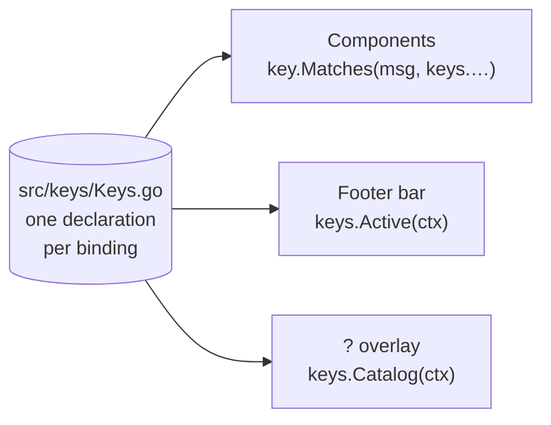

# Keybinding System

Every key in cais is declared exactly once, in `src/keys/Keys.go`. Before this package existed, a key lived in two places — the component that handled it, and the hand-written list in the footer bar that advertised it — with nothing holding the two together, so the bar could promise a key no handler implemented, or stay silent about one that did.

Two rules follow, and they are the reason the package exists:

1. **A key is declared here exactly once.** Components match against these bindings; the footer and the help overlay render from them.
2. **One verb is one binding.** Start is the same key on the group panel and the service panel because both read `keys.Details.Start` — not because two switch statements happen to agree.

## The three readers

The package has three readers, all fed from the same declarations:

- **The components** match with `key.Matches(msg, keys.Details.Start)`.
- **The footer** (`KeybindingBar`) asks `keys.Active(ctx)` — it supplies the screen state, the keymap makes the decision, so the two cannot disagree. `components.TestFooterHints` pins every context.
- **The help overlay** renders `keys.Catalog(ctx)`: every binding grouped by scope, with availability resolved against a snapshot of the screen it opened from. A row that does nothing on that screen is dimmed.

## The binding groups

| Group | What it holds |
| --- | --- |
| `GlobalKeys` | Work anywhere no overlay owns the keyboard: page digits, `[`/`]`, `tab`/`shift+tab`, `esc`, `?`, `a`, `T`, `u`, `v`, `q`, `ctrl+c` |
| `ListKeys` | The body's left panel: navigate, select, new, edit, delete, rename, filter |
| `DetailsKeys` | The body's right panel: start, stop, restart, pull, remove, logs, edit, copy URL, healthcheck, save, open editor |
| `EditorKeys` | Inside the inline YAML editor: new line, indent, outdent |
| `FilesKeys` | The Files page: scroll, browse |
| `BackupKeys` | The Backups page: navigate, restore |
| `OverlayKeys` | Every modal: submit, cancel, next field, toggle, yes, no, follow |

## `keys.Active` — what is live right now

`Active(ctx Context)` takes the page, the focused component, whether the list is empty, whether anything is selected, whether the editor is open, whether an action is pending, and the list's filter state — and returns the bindings the user can press right now, in display order.

It returns a *filtered slice* rather than calling `SetEnabled` on the bindings it wants to hide. `key.Binding.Enabled` gates matching as well as help, and these are package-level values shared with the components: disabling one to tidy the footer would stop the key working everywhere.

## The footer's degradation order

The footer bar sheds whole hints in a declared priority order rather than wrapping to a second line. The order lives in `keys.Priority` and is deliberately not the order `Active` lists keys in: the order to read in is not the order to give up.

| Priority | What it protects | Never dropped |
| --- | --- | --- |
| Duplicated | Page digits (already printed by the nav bar) | — |
| Instinctive | Tab, arrows — discoverable by trying | — |
| Verb | The page's own actions | — |
| Exit | The ways out of wherever you are | — |
| Always | `? help`, `q quit` | always |

## The lists do not get to keep `list.DefaultKeyMap`

A bubbles `list.Model` installs `list.DefaultKeyMap()`, which is written for a list that *is* the whole program. It binds `d` and `f` to next-page, `h`, `b`, and `u` to previous-page, and takes `q`, `esc`, and `?` for itself. Both body lists hand every key to the inner list while focused, *after* matching their own — so those keys did two jobs at once: `d` opened the delete-group confirm **and** paged the list out from under it.

So the lists install `keys.ListKeyMap()` instead. It keeps only what the list alone can answer — cursor movement, `g`/`G`, and `/` — and leaves every key the app owns bound to nothing. `components.TestDeleteKeyDoesNotAlsoPageTheList` and `TestPanelLettersDoNotPageTheList` fail against the default map.

## A list being filtered is an overlay

While a filter is being typed the keystrokes are text: `n` is not "new group", `q` is not "quit". The list says so through `OwnsKeyboard()`, `AppModel.keyboardOwned()` asks every component on the active page, and `Update` drops out of its own key handling when the answer is yes. The lists broadcast `cmds.SetListFilterStateMsg` on the transition, so filtering advertises only the keys that end it, and an applied filter turns the `/` slot into the `esc` that clears it.

## Adding a new keybinding

1. Declare the binding once in `src/keys/Keys.go` — in the group that matches its scope, with `key.WithKeys(...)` and `key.WithHelp(...)`.
2. Match it in the component with `key.Matches(msg, keys.YourGroup.YourBinding)`.
3. Add it to `Active(ctx)` in the contexts where it is live — the footer will advertise it automatically.
4. If it belongs in the help overlay's catalog, it is already there: `Catalog` reads the same bindings.

A key added anywhere else will not be advertised and may collide — that is the whole point of the package.