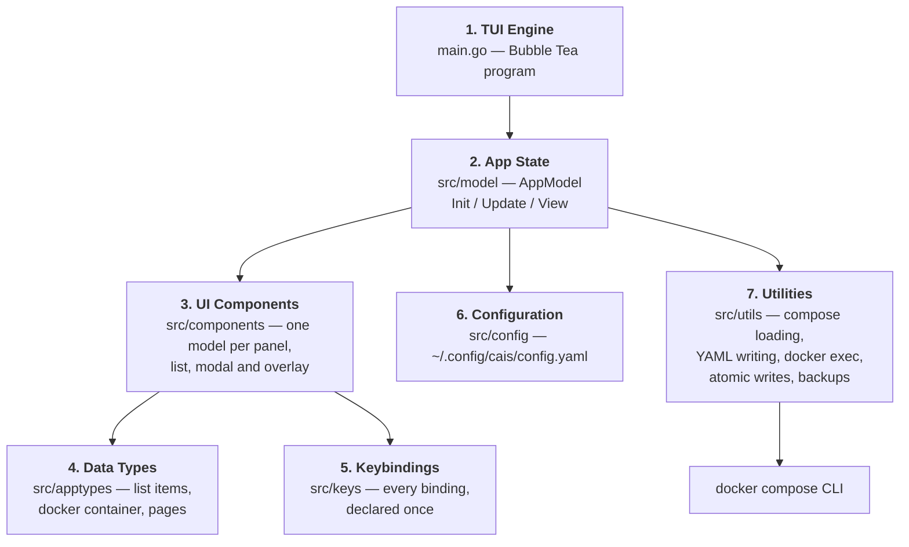

# Overview

This guide is for developers who want to understand cais's architecture and contribute code. It assumes you know Go and basic TUI concepts, but not cais internals.

## The big picture

cais is a keyboard-driven terminal UI for managing Docker Compose stacks. It is built with [Bubble Tea](https://github.com/charmbracelet/bubbletea) and [Lip Gloss](https://github.com/charmbracelet/lipgloss) on top of [compose-go](https://github.com/compose-spec/compose-go) — the same parser Docker itself uses — and it shells out to the `docker compose` CLI rather than binding the Docker SDK.

The architecture is a seven-layer stack:

## How to navigate this guide

- **[Architecture](/contributors/architecture/)** — the seven layers in depth, and how they communicate.
- **[Project structure](/contributors/project-structure/)** — the `src/` tree with per-package responsibilities.
- **[Core concepts](/contributors/core-concepts/)** — the mental model: message passing, the AppModel, the esc ladder.
- **[Keybinding system](/contributors/keybinding-system/)** — the single source of truth design.
- **[Theme system](/contributors/theme-system/)** — how the 13 themes are built from base colors.
- **[Backup system](/contributors/backup-system/)** — the write-safety architecture.
- **[Testing](/contributors/testing/)** — the testing philosophy and how to test a TUI.
- **[Development workflow](/contributors/development-workflow/)** — the build/test loop, CI, and releases.
- **[Contributing](/contributors/contributing/)** — how to contribute, distilled from `CONTRIBUTING.md`.

## The two documents that matter

Before you write code, read `docs/DESIGN.md` in the repo. It records *why* things are the way they are — the group-vs-profile vocabulary, why there is no prefix key, why the compose file resolution order is fixed, where keybindings live. Most of it exists because the alternative was tried first. `docs/ROADMAP.md` is the ordered plan to a first alpha, and `TODO.md` is the flat worklist.