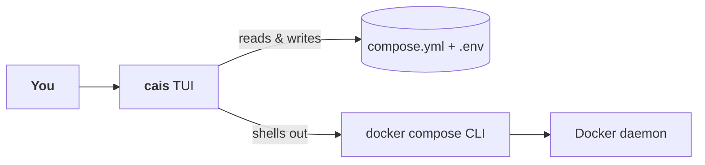

import { Aside, Card, LinkCard } from '@astrojs/starlight/components';

cais is a keyboard-driven terminal UI for a self-hosted stack running on Docker Compose. It reads your `compose.yml` and groups services the way you think about them.

Nothing extra to host. Nothing listening on a port. **Your compose file stays the source of truth.**

  

    
    ~/homelab — cais
  

  

## Where cais fits

Between you and the `docker compose` CLI. It reads and writes the same `compose.yml` the CLI does, so the two never disagree about what your stack is.

**You can always drop back.** Nothing about cais locks you in — edit `compose.yml` by hand in your favourite editor, or run `docker compose` yourself in another terminal, and cais will notice on its next five-second status poll and reflect the change.

## The three principles

Everything else in cais is downstream of these.

  <Card title="Your compose file is the source of truth" icon="document">
    No sidecar state. What you see in the panels is what is in the file. Every change cais makes is written back — comments and key order intact.
  </Card>
  <Card title="Every write is safe" icon="approve-check-circle">
    Every change reaches the file through a single atomic write path, with a snapshot taken first. Nothing you can do to the file isn't already undoable from the [Backups](/users/backups/) page.
  </Card>
  <Card title="No divergence with the CLI" icon="rocket">
    Docker actions shell out to `docker compose` rather than binding the SDK. What cais does is what you would have typed.
  </Card>

## Same tasks, fewer keystrokes

Every action cais takes maps to something you could have typed. It just replaces the typing with a single key.

| Task | On the command line | In cais |
| --- | --- | :---: |
| Start every service in the `media` group | `docker compose --profile media up -d` | `s` |
| Tail logs for one service | `docker compose logs -f jellyfin` | `l` |
| Restart one service | `docker compose restart jellyfin` | `r` |
| Add a healthcheck to Postgres | edit `compose.yml` by hand | `h`, pick a template |
| Undo a bad edit | `git diff && git checkout compose.yml` *(in a repo)* | `4`, `enter` |
| See a running service's URL | `docker compose ps` + guess | look at the `Web` row |
| Copy that URL | mouse-select and copy | `y` |
| Edit the `.env` beside compose | open in `$EDITOR` | `v` |

## What cais does

### Group services the way you think about them

A group is a Compose `profiles:` tag. Start every service in a group with one key, tail all their logs with another, and see at a glance which are running, which are healthy, and on what ports.

### Everything you need to check a service

Ports, restart policy, networks, volumes, `depends_on`, healthcheck, image reference and resource limits — beside live memory, CPU, network and disk I/O for the running container.

### Edit the compose file in place, as YAML

`e` opens a service's own fragment in an inline editor. Real YAML, not a form, so every Compose field is reachable. It validates as you type, auto-indents on Enter, indents with `tab`/`shift+tab`, and refuses to write a fragment that would not parse as Compose.

### Browsable, restorable backups

Every write is snapshotted into `.cais/backups/` first. Tab `4` lists every stored copy of the compose file and `.env`, newest first, with a live preview. `enter` restores; the current file is snapshotted first, **so a restore is itself undoable**.

### And a handful of smaller things that add up

- **A healthcheck in one keypress.** `h` opens a template picker — Postgres, MariaDB, Redis, nginx, plus a generic HTTP fallback — and writes a validated `healthcheck:` block straight into the compose file.
- **New services without leaving the terminal.** `n` on the Services page asks for a name and an image reference, then writes a minimal `image:` fragment into the compose file and opens the inline editor on it — ports, volumes and everything else go in the same YAML you would have hand-written, with live validation the whole way.
- **Logs without leaving.** `l` streams `docker compose logs -f` for one service or a whole group, with follow mode and scrollback.
- **`.env` beside your compose file, in one keypress.** `v` opens a modal with the variable table, a key editor, and the raw file editor in one surface. Variables are masked by default.
- **Thirteen themes**, previewed live as you move the cursor.

## What cais doesn't

<Aside type="note" title="Doesn't try to be a dashboard">
Home is a launchpad: pick a group, act on it, move on. cais doesn't draw CPU graphs, doesn't send notifications, doesn't want you to sit and watch it.
</Aside>

<Aside type="note" title="Doesn't replace docker compose">
It sits in front of `docker compose`, not instead of it. Anything cais can't express, you can still do on the command line — and cais will reflect it on the next status poll.
</Aside>

<Aside type="note" title="Doesn't touch arbitrary containers">
cais acts on what's in your compose file. Containers started outside it — one-off `docker run`s, another stack's containers — are out of scope and left alone.
</Aside>

## Where to next

  <LinkCard
    title="Installation"
    description="Prerequisites and the two ways to install cais."
    href="/users/installation/"
  />
  <LinkCard
    title="Quickstart"
    description="Running against your stack in under a minute."
    href="/users/quickstart/"
  />
  <LinkCard
    title="Usage"
    description="The four pages — Groups, Services, Files, Backups — in depth."
    href="/users/usage/"
  />
  <LinkCard
    title="Contributor Guide"
    description="How the seven layers, keybindings, and write-safety fit together."
    href="/contributors/overview/"
  />

